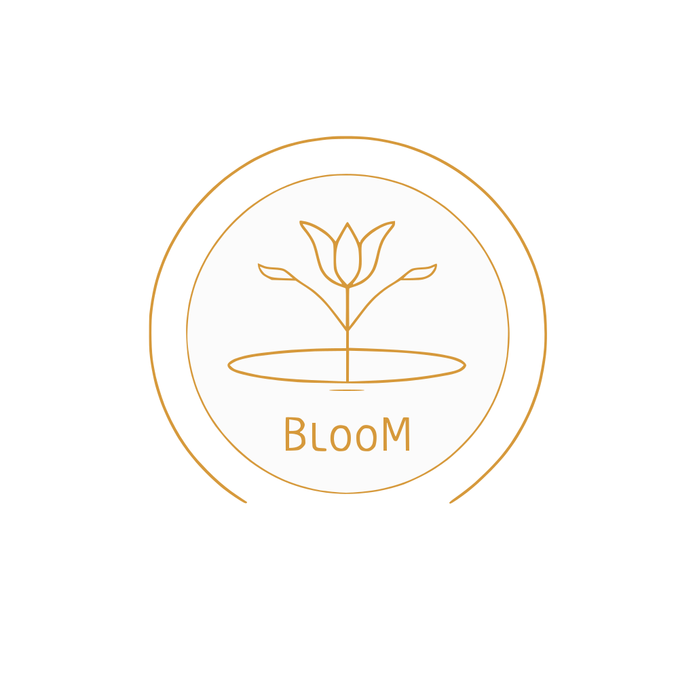

# BlooM

**From a guest's story to a meal and service shaped by the restaurant.**

BlooM is an AI-assisted application for personalised restaurant experiences. A guest shares the occasion, wishes, tastes and constraints through a conversation with Benkei. The application turns that information into culinary directions, supports the guest's selection and the chef's adaptations, then prepares separate working briefs for the kitchen and dining room.

The restaurant keeps authorship: its identity informs the proposals, the chef decides what is feasible and sets the price, and the guest confirms the proposed menu.

**Published application:** [bloommm.fr](https://bloommm.fr)  
**Built by:** [Julien](https://github.com/crosojulien-spec)  
**Documentation snapshot:** 6 October 2026, based on the source export dated 25 September 2026.

This repository is the public product and technical introduction. The full source and detailed prompts are intended for a separate private repository. Source access can be discussed with Julien; no private source repository is linked here until it has been created.

## Choose your starting point

| You want to… | Read |
|---|---|
| Understand the idea and who it serves | [Product and vision](docs/PRODUCT.md) |
| Follow the guest, chef and operator journeys | [Workflow and roles](docs/WORKFLOW.md) |
| See existing examples and recorded results | [Examples and evidence](docs/EXAMPLES.md) |
| Understand how the application is built | [Technical overview](docs/TECHNICAL.md) |
| Assess what is built, tested and still to verify | [Current status](docs/STATUS.md) |

## The experience

1. An invitation associates the guest's journey with a restaurant.
2. Benkei gathers useful context; the guest checks and confirms an editable recap.
3. BlooM prepares five starters, five mains and five desserts, guided by the restaurant profile and guest constraints.
4. The guest selects and ranks preferences; the chef evaluates, adapts and prices menu proposals.
5. The guest chooses and confirms a proposal.
6. BlooM generates Chef and Service draft packs, with operator tools to review, edit and approve them.

The briefs can suggest meaningful ways to prepare and serve the meal. They remain conditional options tied to the restaurant's documented capabilities and the agreed menu.

## Where the project stands

The export contains the guest journey, chef workspace, administration dashboard, AI prompts, database schema and quality tests. A development report records complete preview journeys for two restaurant profiles on 21 September 2026. This is evidence of development testing, not a claim that these restaurants have served paying BlooM guests.

Payment is currently a simulation. External deployment requires configuration work. The code snapshot, historical test results and the live deployment are distinguished throughout these documents; the live site's publication status was checked on 6 October, but its complete operational journey was not rerun for this documentation.

## Why share this repository?

For a curious reader, it explains the product through its users and outputs. For a builder, it makes the process and human decisions visible. For a developer, it identifies the architecture, dependencies and contribution areas before source access.

Every example comes from an existing document, test input or recorded output. Missing steps have not been invented or joined into a fictional end-to-end result.
