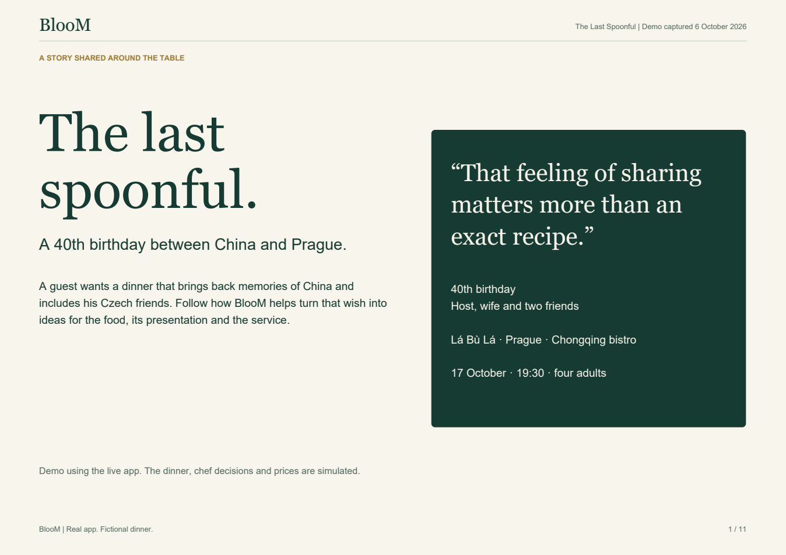

# BlooM

**The guest's story, brought to life by the restaurant's craft.**

A guest brings a memory, an occasion or a moment they want to share. The chef and the team bring the skills, ideas and care to make it part of the meal.

BlooM helps them create it together. An AI conversation gathers what matters to the guest. The restaurant's profile guides ideas for the food, presentation and service. The chef reviews the suggestions and sets the prices; the guest chooses a menu.

**[Visit bloommm.fr](https://bloommm.fr)** · **[Read the 11-slide demo (PDF)](docs/demos/the-last-spoonful/BlooM%20-%20The%20Last%20Spoonful%20-%20Presentation.pdf)** · **[Follow the illustrated walkthrough](docs/demos/the-last-spoonful/README.md)**

## See it through one dinner

For his 40th birthday, a guest wants to share memories of China with his wife and two Czech friends. He remembers hong shao rou and sharing the last spoonful of sauce. Their friends' plum desserts bring Prague into the story.

The demo follows that request through restaurant DNA, an off-menu dish idea, a chef review, the guest's choice and suggestions for the kitchen and service team. The personal touches include a bowl to share, four spoons and a quiet introduction at the table.

**Real app, fictional dinner.** Captured on 6 October 2026 at bloommm.fr. The application generated the suggestions and packs; chef decisions and prices were simulated. The restaurant has not approved or served this meal. [Read the evidence notes.](docs/demos/the-last-spoonful/evidence.md)

## What this makes possible

For the guest, a meal can become a way to share something personal with others.

For the restaurant, it opens up more of what its people can do, beyond the dishes listed on a menu: a chef's cooking and presentation, the team's welcome, and the small touches that make an evening feel special. The team decides what is feasible and what it can offer.

## How it works

1. **Tell the story.** The guest opens a restaurant-linked invitation and talks with Benkei, BlooM's AI assistant, then checks the recap.
2. **Explore ideas.** BlooM uses the guest's wishes and the restaurant's DNA to suggest dishes. The guest selects preferences.
3. **Let the chef decide.** The chef accepts, changes or removes suggestions and sets prices.
4. **Choose the meal.** The guest selects and confirms a proposed menu. Payment is simulated in the current app.
5. **Prepare the details.** Separate Chef and Service packs suggest preparation, presentation and service ideas for human review.

Restaurant DNA records the cooking style, ingredients, reference dishes and service limits. It helps ground the ideas in what the restaurant does. Stock, equipment and special gestures still need the team's confirmation.

## Explore the project

| Looking for | Start here |
|---|---|
| A concrete example, with screenshots | [The Last Spoonful](docs/demos/the-last-spoonful/README.md) |
| The idea, users and restaurant DNA | [Product](docs/PRODUCT.md) |
| The guest, chef and operator journey | [Workflow](docs/WORKFLOW.md) |
| The live demo and earlier development examples | [Examples and evidence](docs/EXAMPLES.md) |
| What works, what was tested and what needs work | [Current status](docs/STATUS.md) |
| Architecture and source setup | [Technical overview](docs/TECHNICAL.md) |

## Current stage and source access

BlooM is a working MVP with a published site at [bloommm.fr](https://bloommm.fr). The captured demo reaches menu confirmation and both generated packs. It demonstrates the software journey; restaurant delivery and commercial results remain to be validated. [Current status](docs/STATUS.md) records the known limits and dated checks.

This public repository is the product showcase and documentation. It has no application code to install. The full source, prompts, tests and setup instructions are in the private [bloom-app-source](https://github.com/crosojulien-spec/bloom-app-source) repository. Contact [Julien](https://github.com/crosojulien-spec) to discuss the project or source access.

Documentation updated 7 October 2026. Live demo captured 6 October 2026; technical documentation refers to the source export dated 25 September 2026.
