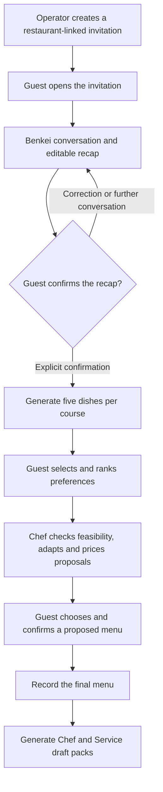
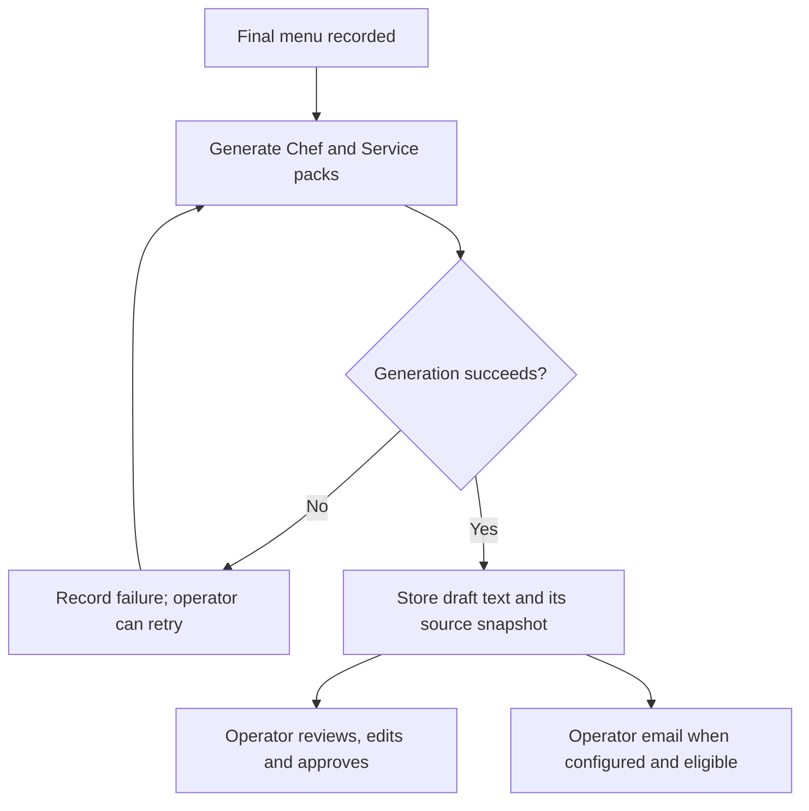

# Workflow and roles

The current application links guest input, restaurant context and professional decisions. The diagrams describe the source snapshot dated 25 September 2026, with qualifications where the implementation differs from the intended operating model.

## Guest and chef journey

The confirmation interface includes a payment simulation. No actual payment provider or financial transaction is connected in the inspected source.

## What moves between stages?

| Stage | Information passed forward | Human control |
|---|---|---|
| Invitation | Restaurant association, guest contact and language | Operator chooses the restaurant and recipient. |
| Discovery | Occasion, date, party size, tastes, constraints, concrete story details and service wishes | Guest decides what to share. |
| Recap | Corrected structured dossier and explicit constraint state | Guest can correct fields and must validate the recap. |
| Culinary proposals | Five starters, five mains and five desserts | Guest selects and ranks preferences. |
| Chef proposals | Feasibility, adapted dishes, prices and menu composition | Chef decides and proposes. |
| Final choice | Selected menu and confirmation timestamp | Guest confirms a proposal. |
| Professional packs | Final menu, corrected dossier and restaurant profiles | Operator can review, edit, approve and retry the text. |

A new conversation message invalidates the earlier recap approval. Manual corrections take priority over older conversational information. Unknown constraints are not silently converted into an absence of constraints.

## Professional packs and delivery

The review controls exist, but automatic operator email is currently **not gated by pack approval**. An email to the BlooM operator is not proof of delivery to restaurant staff or of execution during service.

Pack generation runs after confirmation. A generation or email failure does not reverse the guest's recorded confirmation. Stored leases, retry tools and protections against overwriting manual edits are present; the background work does not yet use a durable job queue.

## Restaurant context throughout the flow

Benkei receives the associated restaurant's service profile when available. Culinary generation combines the guest's constraints and story with the kitchen profile. Professional packs receive the final menu and both kitchen and service profiles.

An empty profile field means that a capability or permission has not been documented. The prompts explicitly separate an optional suggestion from a chosen action or a promise to the guest.

## What the dashboard provides

The admin interface supports invitations, request lists, internal request detail and professional pack operations. The chef workspace supports feasibility, adaptation, pricing and menu proposals. Guest pages support invitation access, discovery, selection and final validation.

The functional journey is ahead of the access-control model: a dedicated, separately authenticated chef account per restaurant has not been established. See [Status](STATUS.md) before interpreting these screens as a production-ready multi-restaurant platform.

**Source basis:** `client/src/pages/Invite.tsx`, `client/src/components/ChatbotDiscovery.tsx`, `client/src/components/MenuSelection.tsx`, `client/src/components/ChefDashboard.tsx`, `client/src/components/ClientFinalValidation.tsx`, `client/src/pages/AdminRequestDetail.tsx`, `server/routes.ts` and `server/storage.ts`.
